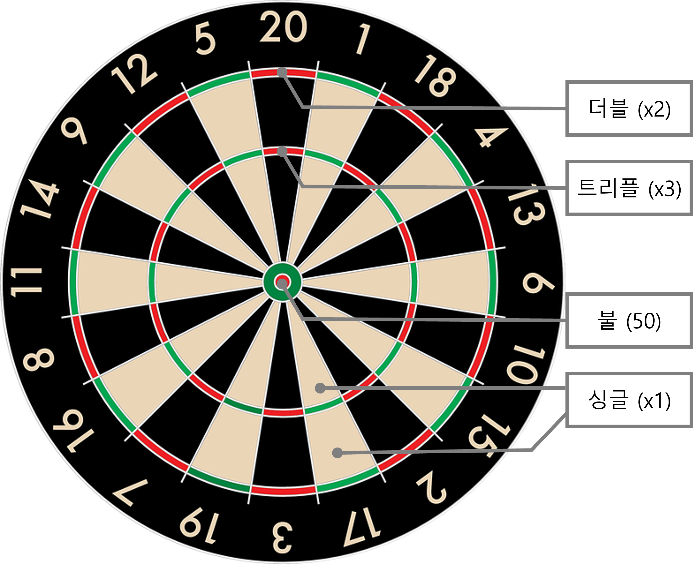

# [카운트 다운](https://school.programmers.co.kr/learn/courses/30/lessons/131129)

## 문제 설명

프로그래머스 다트 협회에서는 매년마다 새로운 특수 룰으로 다트 대회를 개최합니다. 이번 대회의 룰은 "카운트 다운"으로 "제로원" 룰의 변형 룰입니다.
"카운트 다운"은 게임이 시작되면 무작위로 점수가 정해지고, 다트를 던지면서 점수를 깎아서 정확히 0점으로 만드는 게임입니다. 단, 남은 점수보다 큰 점수로 득점하면 버스트가 되며 실격 합니다.

다음 그림은 다트 과녁입니다.

다트 과녁에는 1 부터 20 까지의 수가 하나씩 있고 각 수마다 "싱글", "더블", "트리플" 칸이 있습니다. "싱글"을 맞히면 해당 수만큼 점수를 얻고 "더블"을 맞히면 해당 수의 두 배만큼 점수를 얻고 "트리플"을 맞히면 해당 수의 세 배만큼 점수를 얻습니다. 가운데에는 "불"과 "아우터 불"이 있는데 "카운트 다운" 게임에서는 구분 없이 50점을 얻습니다.

대회는 토너먼트로 진행되며 한 게임에는 두 선수가 참가하게 됩니다. 게임은 두 선수가 교대로 한 번씩 던지는 라운드 방식으로 진행됩니다. 가장 먼저 0점을 만든 선수가 승리하는데 만약 두 선수가 같은 라운드에 0점을 만들면 두 선수 중 "싱글" 또는 "불"을 더 많이 던진 선수가 승리하며 그마저도 같다면 선공인 선수가 승리합니다.

다트 실력에 자신 있던 종호는 이 대회에 출전하기로 하였습니다. 최소한의 다트로 0점을 만드는 게 가장 중요하고, 그러한 방법이 여러가지가 있다면 "싱글" 또는 "불"을 최대한 많이 던지는 방법을 선택해야 합니다.

목표 점수 `target`이 매개변수로 주어졌을 때 최선의 경우 던질 다트 수와 그 때의 "싱글" 또는 "불"을 맞춘 횟수(합)를 순서대로 배열에 담아 return 하도록 solution 함수를 완성해 주세요.

## 제한사항

- 1 ≤ `target` ≤ 100,000

## 입출력 예

| target | result |
| ------ | ------ |
| 21     | [1,0]  |
| 58     | [2,2]  |

## 입출력 예 설명

### 입출력 예 #1

7 트리플로 21점을 만들 수 있습니다.

### 입출력 예 #2

불 + 8 싱글로 58점을 만들 수 있습니다.
