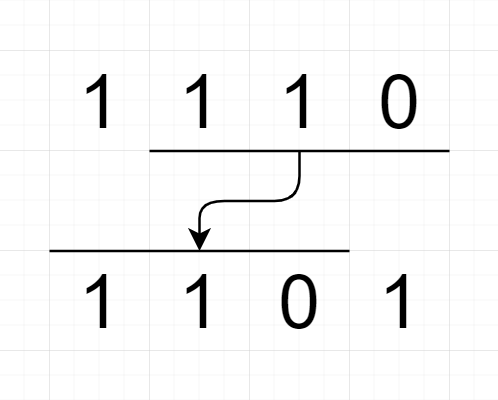
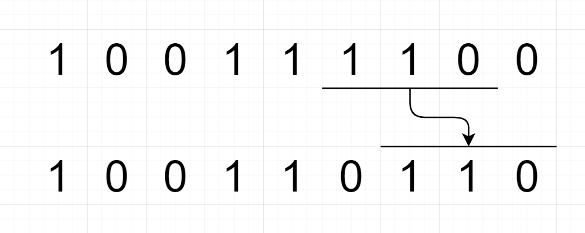
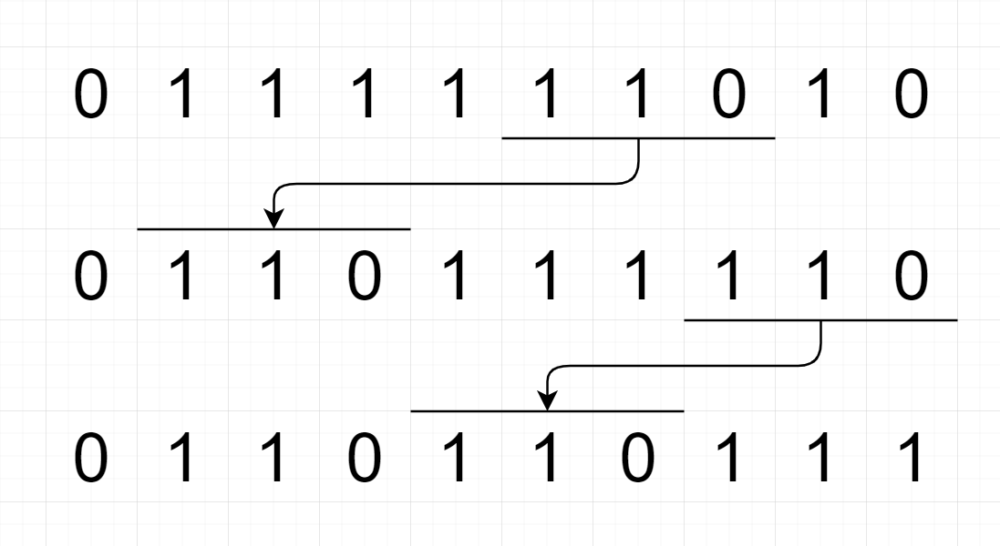

# [110 옮기기](https://school.programmers.co.kr/learn/courses/30/lessons/77886)

## 문제 설명

0과 1로 이루어진 어떤 문자열 x에 대해서, 당신은 다음과 같은 행동을 통해 x를 최대한 사전 순으로 앞에 오도록 만들고자 합니다.

x에 있는 "110"을 뽑아서, 임의의 위치에 다시 삽입합니다.
예를 들어, x = "11100" 일 때, 여기서 중앙에 있는 "110"을 뽑으면 x = "10" 이 됩니다. 뽑았던 "110"을 x의 맨 앞에 다시 삽입하면 x = "11010" 이 됩니다.

변형시킬 문자열 x가 여러 개 들어있는 문자열 배열 `s`가 주어졌을 때, 각 문자열에 대해서 위의 행동으로 변형해서 만들 수 있는 문자열 중 사전 순으로 가장 앞에 오는 문자열을 배열에 담아 return 하도록 solution 함수를 완성해주세요.

## 제한사항

- 1 ≤ `s`의 길이 ≤ 1,000,000
- 1 ≤ `s`의 각 원소 길이 ≤ 1,000,000
- 1 ≤ `s`의 모든 원소의 길이의 합 ≤ 1,000,000

## 입출력 예

| s                                 | result                            |
| --------------------------------- | --------------------------------- |
| ["1110","100111100","0111111010"] | ["1101","100110110","0110110111"] |

## 입출력 예 설명

### 입출력 예 #1

다음 그림은 "1110"을 "1101"로 만드는 과정을 나타낸 것입니다.

"1101"보다 사전 순으로 더 앞에 오는 문자열을 만들 수 없으므로, 배열에 "1101"을 담아야 합니다.

다음 그림은 "100111100"을 "100110110"으로 만드는 과정을 나타낸 것입니다.

"100110110"보다 사전 순으로 더 앞에 오는 문자열을 만들 수 없으므로, 배열에 "100110110"을 담아야 합니다.
그림에 나온 방식 말고도 다른 방법으로 "100110110"을 만들 수 있습니다.

다음 그림은 "0111111010"을 "0110110111"로 만드는 과정을 나타낸 것입니다.

"0110110111"보다 사전 순으로 더 앞에 오는 문자열을 만들 수 없으므로, 배열에 "0110110111"을 담아야 합니다.
그림에 나온 방식 말고도 다른 방법으로 "0110110111"을 만들 수 있습니다.
