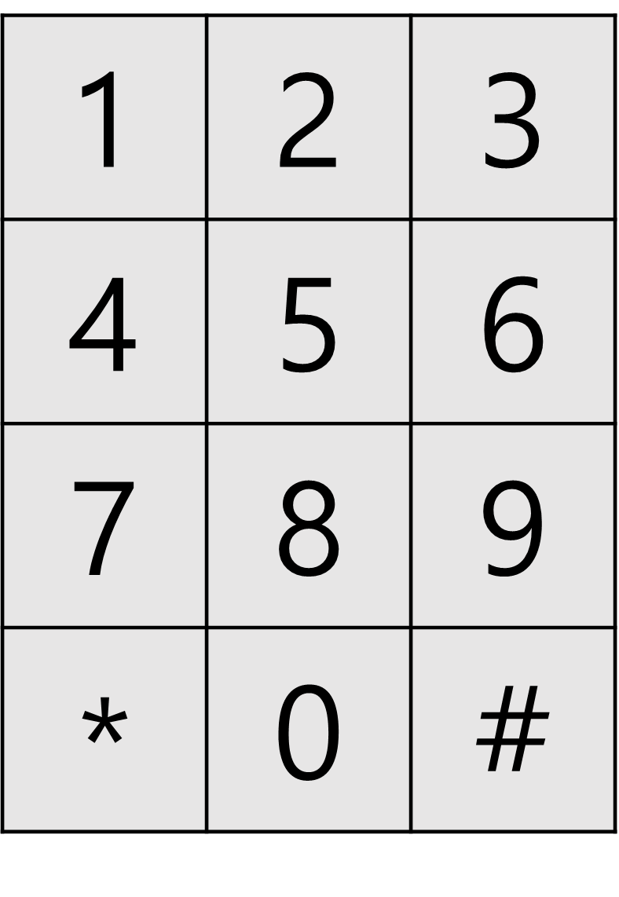

# [숫자 타자 대회](https://school.programmers.co.kr/learn/courses/30/lessons/136797)

## 문제 설명


위와 같은 모양으로 배열된 숫자 자판이 있습니다. 숫자 타자 대회는 이 동일한 자판을 사용하여 숫자로만 이루어진 긴 문자열을 누가 가장 빠르게 타이핑하는지 겨루는 대회입니다.

대회에 참가하려는 민희는 두 엄지 손가락을 이용하여 타이핑을 합니다. 민희는 항상 왼손 엄지를 4 위에, 오른손 엄지를 6 위에 두고 타이핑을 시작합니다. 엄지 손가락을 움직여 다음 숫자를 누르는 데에는 일정 시간이 듭니다. 민희는 어떤 두 숫자를 연속으로 입력하는 시간 비용을 몇몇 가중치로 분류하였습니다.

- 이동하지 않고 제자리에서 다시 누르는 것은 가중치가 1입니다.
- 상하좌우로 인접한 숫자로 이동하여 누르는 것은 가중치가 2입니다.
- 대각선으로 인접한 숫자로 이동하여 누르는 것은 가중치가 3입니다.
- 같지 않고 인접하지 않은 숫자를 누를 때는 위 규칙에 따라 가중치 합이 최소가 되는 경로를 따릅니다.

예를 들어 1 위에 있던 손가락을 0 으로 이동하여 누르는 것은 2 + 2 + 3 = 7 만큼의 가중치를 갖습니다.
단, 숫자 자판은 버튼의 크기가 작기 때문에 같은 숫자 버튼 위에 동시에 두 엄지 손가락을 올려놓을 수 없습니다. 즉, 어떤 숫자를 눌러야 할 차례에 그 숫자 위에 올려져 있는 손가락이 있다면 반드시 그 손가락으로 눌러야 합니다.

숫자로 이루어진 문자열 `numbers`가 주어졌을 때 최소한의 시간으로 타이핑을 하는 경우의 가중치 합을 return 하도록 solution 함수를 완성해주세요.

## 제한사항

- 1 ≤ `numbers`의 길이 ≤ 100,000
- `numbers`는 아라비아 숫자로만 이루어진 문자열입니다.

## 입출력 예

| numbers | result |
| ------- | ------ |
| "1756"  | 10     |
| "5123"  | 8      |

## 입출력 예 설명

### 입출력 예 #1

왼손 엄지로 17, 오른손 엄지로 56을 누르면 가중치 10으로 최소입니다.

### 입출력 예 #2

오른손 엄지로 5, 왼손 엄지로 123을 누르거나 오른손 엄지로 5, 왼손 엄지로 1, 오른손 엄지로 23을 누르면 가중치 8로 최소입니다.

## 문제 풀이

해당 문제를 Brute Force 방법으로 해결할 경우 2^100000가지 방법을 모두 계산해야 하므로 절대 해결할 수 없다. 따라서 이 문제는 DP로 해결해야 한다. 왜냐면 '이전에 내린 최적의 답안에서 최적의 왼손/오른손을 택한다'로 경우의 수를 최소화할 수 있기 때문이다.

시간 복잡도와 공간 복잡도를 계산해보면 다음과 같다.

```
N = numbers의 길이
M = 왼손, 오른손이 누를 수 있는 경우의 수(10)

공간 복잡도 = O(N * M^2)
시간 복잡도 = O(N * M^2)
```

10\*10은 작은 수라고 할 수 있으므로 O(n)에 근접하게 문제를 해결할 수 있다.

DP 배열은 아래와 같이 정의했다.

```
N = numbers의 N 번째 숫자
LEFT = 왼손이 위치한 숫자
RIGHT = 오른손이 위치한 숫자
```

각 손가락이 이동하는 데에 따른 가중치는 정해져 있으므로 아래와 같이 정의하여 사용했다.

```
weight[from][to] = from 번호에서 to 번호로 이동할 때의 가중치
```

결국 N번째 숫자를 눌렀을 때, 왼손이 L에 있고 오른손이 R에 있을 경우를 `f(N, L, R)`라고 하면 나올 수 있는 점화식은 다음과 같다. 여기서는 직전에 누른 숫자를 K라고 했다.

```
f(N, L, R) = min(f(N-1, L, K), f(N-1, K, R))
```

그리고 마지막으로 '숫자 자판은 버튼의 크기가 작기 때문에 같은 숫자 벝느 위에 동시에 두 엄지 손가락을 올려 놓을 수 없다'라고 했으므로 이 경우만 예외 처리를 해주면 된다.
